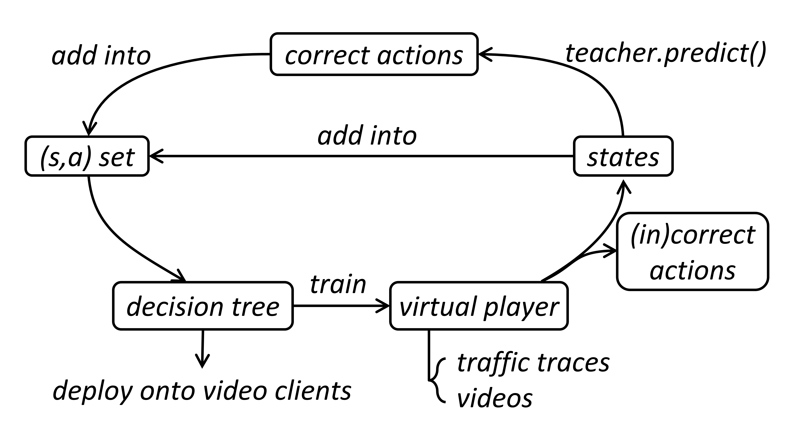

<center>
<a href="https://zilimeng.com"><b>Zili Meng</b></a>, 
<a href="#"><b>Jing Chen</b></a>,
<a href="#"><b>Yaning Guo</b></a>, 
<a href="http://netarchlab.tsinghua.edu.cn/~chensun/"><b>Chen Sun</b></a>, 
<a href="https://people.cs.clemson.edu/~hongxih/"><b>Hongxin Hu</b></a>, 
<a href="http://routing.netlab.edu.cn/tiki-index.php?page=Mingwei+Xu"><b>Mingwei Xu</b></a>      
</center>

<center>Tsinghua University and Clemson University</center>



## Abstract
Major commercial client-side video players employ adaptive bitrate (ABR) algorithms to improve user quality of experience (QoE). With the evolvement of ABR algorithms, increasingly complex methods such as neural networks have been adopted to pursue better performance. However, these complex methods are too heavyweight to be directly implemented in client devices, especially mobile phones with very limited resources. Existing solutions suffer from a tradeoff between algorithm performance and deployment overhead. To make the implementation of sophisticated ABR algorithms practical, we propose PiTree, a general, high-performance and scalable framework that can faithfully convert sophisticated ABR algorithms into lightweight decision trees to reduce deployment overhead. We also provide a theoretical analysis on the upper bound of performance loss during conversion. Evaluation results on three representative ABR algorithms demonstrate that PiTree could faithfully convert ABR algorithms into decision trees with less than 3% average performance loss. Moreover, comparing to original implementation solutions, PiTree could save operating expenses by up to millions of dollars every month for large content providers.

## Paper
PiTree: Practical Implementation of ABR Algorithms Using Decision Trees

Zili Meng, Jing Chen, Yaning Guo, Chen Sun, Hongxin Hu, Mingwei Xu

In _Proceedings of the [ACM International Conference on Multimedia (2019)](https://www.acmmm.org/2019/)_

[[Paper](https://zilimeng.com/papers/pitree-mm19.pdf)][[ACM DL](https://dl.acm.org/doi/abs/10.1145/3343031.3350866)]

## Citation

```
@inproceedings{meng2019pitree,
 author = {Meng, Zili and Chen, Jing and Guo, Yaning and Sun, Chen and Hu, Hongxin and Xu, Mingwei},
 title = {PiTree: Practical Implementation of ABR Algorithms Using Decision Trees},
 year = {2019},
 url = {https://doi.org/10.1145/3343031.3350866},
 booktitle = {Proceedings of the 27th ACM International Conference on Multimedia},
 pages = {2431–2439},
 location = {Nice, France},
 series = {MM ’19}
}
```

## Poster
[[Poster](https://zilimeng.com/papers/pitree-mm19-poster.pdf)]

## Slides
[[Slides](https://zilimeng.com/papers/pitree-mm19-slides.pdf)]


## Supporters
This project is supported by National Key R&D Program of China (2017YFB0801701) and National Science Foundation of China (61625203, 61832013, 61872426).

## Contact

For any questions, please send an email to [zilim@ieee.org](mailto:zilim@ieee.org).